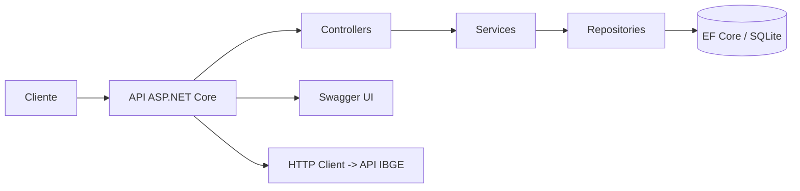
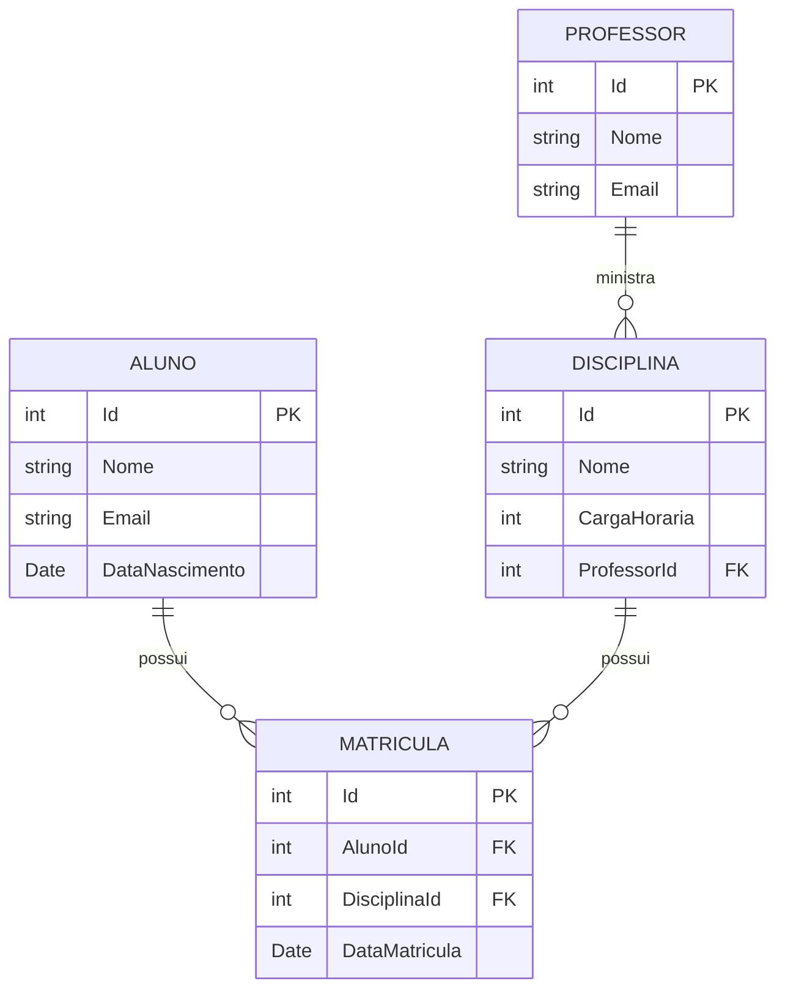

# Diagramas

## Arquitetura (Mermaid)

```mermaid
flowchart LR
A[Cliente] --> B[API ASP.NET Core]
B --> C[Controllers]
C --> D[Services]
D --> E[Repositories]
E --> F[(EF Core / SQLite)]
B --> G[Swagger UI]
B --> H[HTTP Client -> API IBGE]
```
## DER (Mermaid)

```mermaid
erDiagram
    ALUNO ||--o{ MATRICULA : possui
    DISCIPLINA ||--o{ MATRICULA : possui
    PROFESSOR ||--o{ DISCIPLINA : ministra
    ALUNO {
        int Id PK
        string Nome
        string Email
        Date DataNascimento
    }
    PROFESSOR {
        int Id PK
        string Nome
        string Email
    }
    DISCIPLINA {
        int Id PK
        string Nome
        int CargaHoraria
        int ProfessorId FK
    }
    MATRICULA {
        int Id PK
        int AlunoId FK
        int DisciplinaId FK
        Date DataMatricula
    }
```
