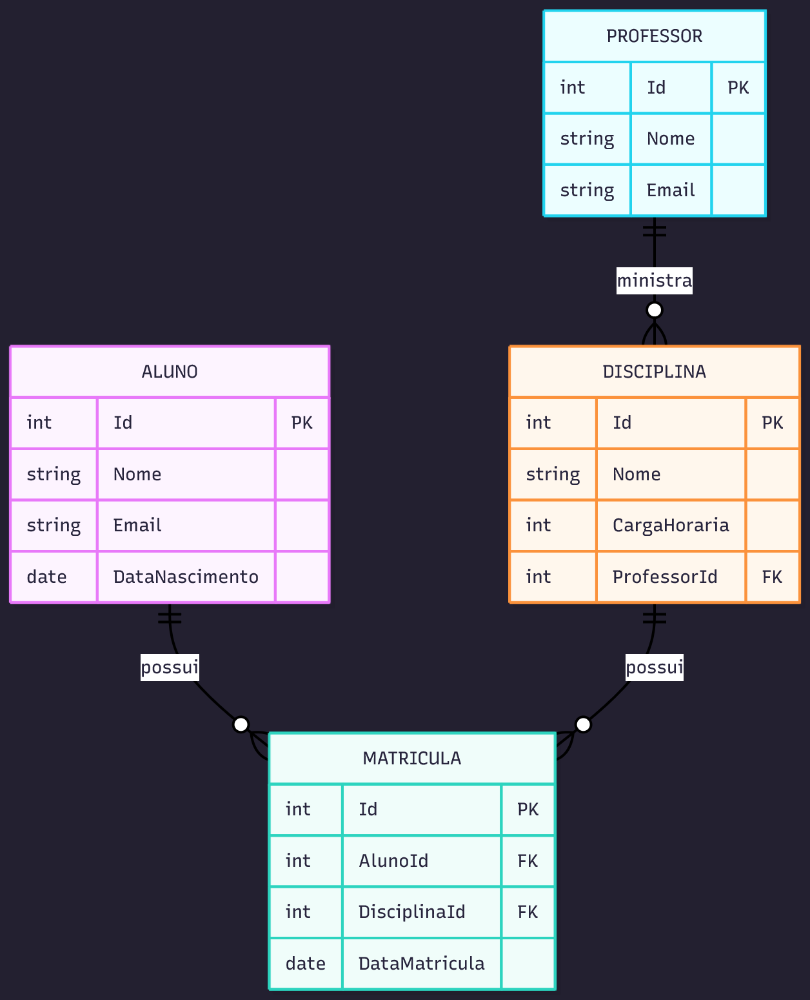

# SwaggerSchoolAPI

## Integrantes
- Aksel Viktor Caminha Rae — RM99011  
- Ian Xavier Kuraoka — RM98860  
- Arthur Petrin — RM98735  
- Miguel Ruan de Souza — RM551239  

## Descrição
API RESTful desenvolvida em ASP.NET Core 8 com Entity Framework Core (SQLite) e documentada via Swagger.  
O projeto implementa um CRUD completo para Aluno, Professor, Disciplina e Matrícula,  
inclui pesquisas com LINQ, e integra dados externos por meio da API pública do IBGE.

---

## Como executar (localmente)

1. Certifique-se de ter o .NET 8 SDK instalado.  
2. No diretório raiz do projeto, execute:
   ```bash
   dotnet restore
   dotnet ef migrations add InitialCreate
   dotnet ef database update
   dotnet run
   ```
3. Acesse o Swagger pelo navegador:
   - http://localhost:5200/swagger  
   - ou https://localhost:7200/swagger

---

## Publicação (Azure Cloud)

O projeto está publicado no Azure App Service e pode ser acessado diretamente via Swagger:

[Acessar Swagger na Nuvem](https://swaggerschoolapi-3espf-ead4geaqfabjdaa4.brazilsouth-01.azurewebsites.net/swagger)

---

## Endpoints Principais

| Método | Rota | Descrição |
|--------|------|------------|
| GET | /api/alunos | Lista todos os alunos |
| GET | /api/alunos/search?nome=ana | Pesquisa com LINQ |
| GET | /api/alunos/ranking-matriculas | Ranking de matrículas (LINQ) |
| GET | /api/professores | Lista professores |
| GET | /api/disciplinas | Lista disciplinas |
| GET | /api/matriculas | Lista matrículas |
| GET | /api/integracoes/ibge/estados | Integração com API externa (IBGE) |

---

## Estrutura do Projeto
```
SwaggerSchoolAPI/
 ├── Controllers/      # Endpoints da API
 ├── Models/           # Entidades (Aluno, Professor, etc.)
 ├── Data/             # Contexto e migrations do Entity Framework
 ├── Services/         # Lógica de negócio e consultas LINQ
 ├── Repositories/     # Acesso e persistência de dados
 ├── Diagrams/         # Diagramas de arquitetura e DER
 │    └── chart.png
 └── README.md
```

---

## Arquitetura
O projeto segue o padrão em camadas:
```
Controllers → Services → Repositories → Data (EF Core)
                           ↓
                        SQLite + API IBGE
```

---

## Diagrama Entidade-Relacionamento (DER)

O diagrama abaixo representa as entidades e relacionamentos principais do sistema:



---

## Documentação e Diagramas
Os diagramas de arquitetura foram desenvolvidos em Mermaid e exportados em PNG:
1. Arquitetura lógica  
2. Implantação na nuvem (Azure)  
3. Componentes internos  
4. Fluxo de requisição  
5. DER (Entidades e Relacionamentos)

Todos estão disponíveis na pasta /Diagrams.

---

## Observações finais
- Swagger habilitado em ambiente de produção (Azure).  
- Deploy contínuo via GitHub Actions.
